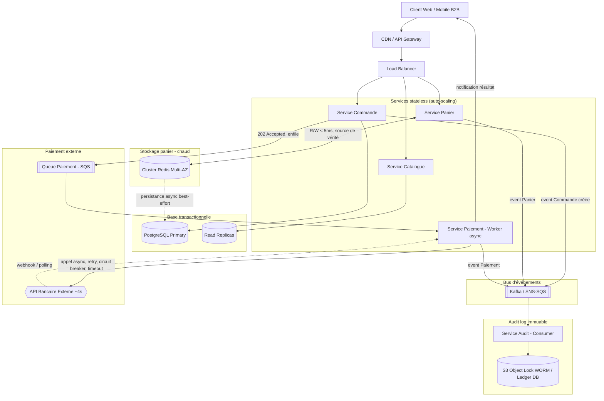

# Architecture Technique - MegaShop-B2B

## Diagramme d'architecture

```mermaid
graph TB
    Client[Client Web / Mobile B2B]
    CDN[CDN / API Gateway]
    LB[Load Balancer]

    subgraph SVC["Services stateless (auto-scaling)"]
        Catalog[Service Catalogue]
        CartSvc[Service Panier]
        OrderSvc[Service Commande]
        PaymentSvc[Service Paiement - Worker async]
    end

    subgraph CACHE["Stockage panier - chaud"]
        Redis[(Cluster Redis Multi-AZ)]
    end

    subgraph DB["Base transactionnelle"]
        PG[(PostgreSQL Primary)]
        PGReplica[(Read Replicas)]
    end

    subgraph BUS["Bus d'événements"]
        Kafka[[Kafka / SNS-SQS]]
    end

    subgraph AUDIT["Audit log immuable"]
        AuditSvc[Service Audit - Consumer]
        S3WORM[(S3 Object Lock WORM / Ledger DB)]
    end

    subgraph PAY["Paiement externe"]
        Queue[[Queue Paiement - SQS]]
        BankAPI{{API Bancaire Externe ~4s}}
    end

    Client --> CDN --> LB
    LB --> Catalog
    LB --> CartSvc
    LB --> OrderSvc

    CartSvc <-->|R/W < 5ms, source de vérité| Redis
    Redis -.->|persistance async best-effort| PG

    Catalog --> PGReplica
    OrderSvc --> PG

    OrderSvc -->|event Commande créée| Kafka
    CartSvc -->|event Panier| Kafka
    PaymentSvc -->|event Paiement| Kafka
    Kafka --> AuditSvc --> S3WORM

    OrderSvc -->|202 Accepted, enfile| Queue
    Queue --> PaymentSvc
    PaymentSvc -->|appel async, retry, circuit breaker, timeout| BankAPI
    BankAPI -.->|webhook / polling| PaymentSvc
    PaymentSvc -->|notification résultat| Client
```
