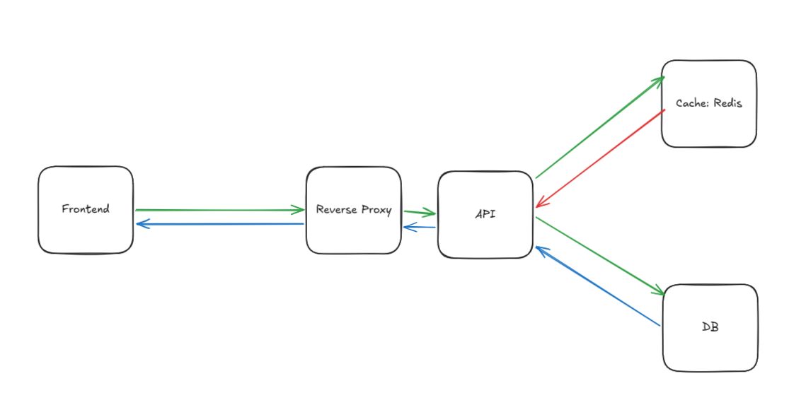

# How the stack works

## Services

1. reverse_proxy (NGINX): Entry point, routes traffic to frontend or api based on path.
2. frontend (NGINX): Serves static files on /.
3. api (Node.js): Backend service on port 3000, depends on db and cache.
4. db (PostgreSQL): Persistent database with volume db_data.
5. cache (Redis): In-memory cache with volume redis_data.

## Networks

- All services share app_network (bridge driver), enabling internal communication (e.g., api:3000, db:5432).

## Data Storage

- PostgreSQL data: /var/lib/postgresql/data → db_data volume.
- Redis data: /data → redis_data volume.

## Request Flow

1. External Request: http://localhost:8080 (or /api for backend) → reverse_proxy:80.
2. Reverse Proxy Routing:
    - /api → Proxied to api:3000.
    - / → Proxied to frontend:80.
3. API Processing:
    - Reads/writes to db:5432 (PostgreSQL) and cache:6379 (Redis).
4. Response: Returns to client via reverse_proxy.

## Ports Exposed to Host

- 8080 (reverse_proxy)
- 5432 (db, direct access)
- 6379 (cache, direct access)

## Diagram

